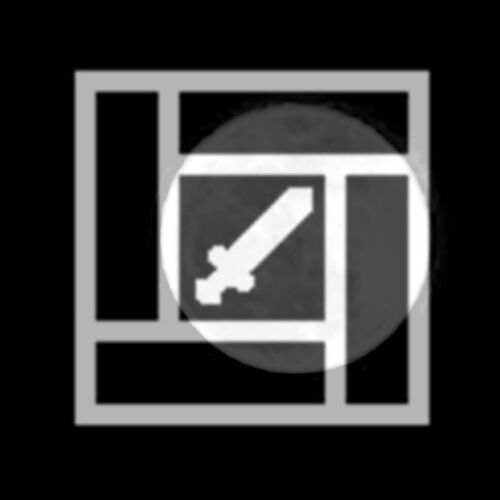

  

<h1 align="center">来自某人的综合设计</h1>
<h3 align="center">Complicated (from thoughts like) Winds</h3>
<h3 align="center">- 庭中花雨 - 春勝寒冬 -</h3>
<h3 align="center">- 月篩晝雨 - 明光暗痟 -</h3>

> *倉庫裏的項目，源自某些人某些時候的某些思想。這些人不一定有極品頭腦，不一定有優勢思維，只要敢想，往前一步都是秋前盛夏。*

  

<h2 align="center">库中的设计</h2>

**对外公开：**

- [本组织|-complicated-winds-](https://github.com/ComplicatedWinds/.github)
- [快速搭建的聊天室|fastchatrooms](https://github.com/ComplicatedWinds/fastchatrooms)
    - 源自某项目的模块思想，方便快速构建消息系统。
